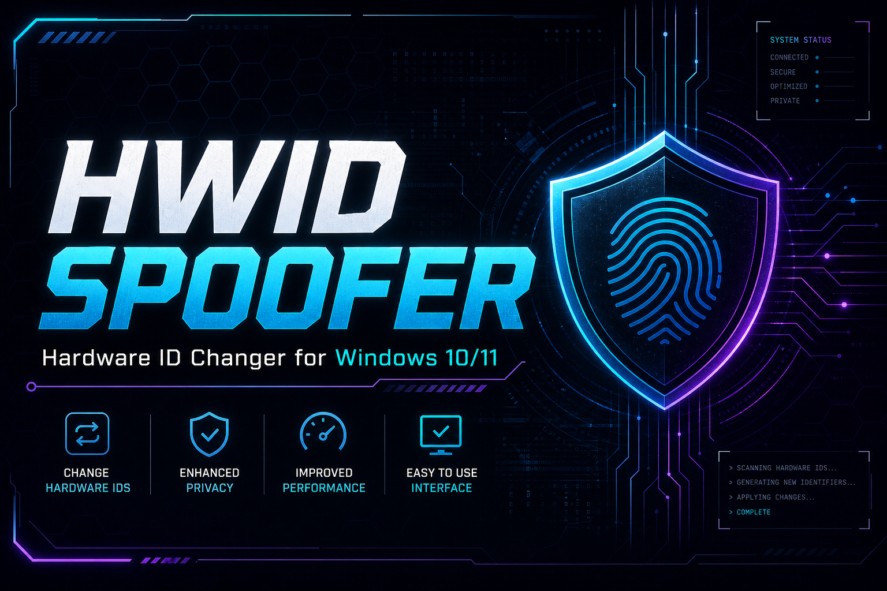

<p align="center">
  
</p>

<h1 align="center">HWID Spoofer</h1>

<p align="center">
  <strong>Hardware identifier management tool for Windows 10 / 11 (x64)</strong>
</p>

<p align="center">
  <a href="LICENSE"></a>
  <a href="https://github.com/topics/windows"></a>
  <a href="https://github.com/topics/cplusplus"></a>
  <a href="https://github.com/topics/hardware"></a>
  <a href="https://github.com/topics/automation"></a>
</p>

<p align="center">
  
</p>

---

## Overview

**HWID Spoofer** is an open-source Windows utility for reading, backing up, and temporarily modifying hardware identifiers used by software and games for device fingerprinting. Built for researchers, developers, and power users who need to test fingerprinting logic on their **own machines**.

- Read current disk serial, SMBIOS UUID, MAC address, and volume IDs
- One-click backup of original identifiers before any change
- Restore original values on reboot or via manual restore
- Clean CLI and optional GUI — no bundled third-party tools
- Fully auditable C++ source — build it yourself

> **Disclaimer:** Use only on systems you own. You are responsible for compliance with applicable laws and software terms of service.

---

## Features

| Module | Description |
|--------|-------------|
| **Disk Serial** | Reads and spoofs ATA/NVMe serial strings exposed to user-mode |
| **SMBIOS** | Handles system UUID, baseboard serial, and product strings |
| **Network MAC** | Randomizes or sets custom MAC on selected adapters |
| **Volume Serial** | Modifies NTFS volume serial number |
| **Registry HWID** | Cleans common fingerprint keys under `HKLM\SOFTWARE\Microsoft` |
| **Backup / Restore** | JSON snapshot saved locally — one command to roll back |
| **Auto-update repo** | GitHub Actions commits timestamp every 30 minutes |

---

## Requirements

| Requirement | Details |
|-------------|---------|
| OS | Windows 10 / 11 (64-bit) |
| Privileges | Administrator (required for driver-level operations) |
| Toolchain | Visual Studio 2022 + Windows SDK 10.0.22621+ |
| Optional | WDK 10 for kernel driver build (`driver/` module) |

> **Linux and macOS are not supported.** This project targets the Windows hardware stack only.

---

## Quick Start

### Download (pre-built)

[](../../releases/latest)

1. Go to [**Releases**](../../releases/latest)
2. Download `HWIDSpoofer-x64.zip`
3. Extract and run `.exe` **as Administrator**
4. Use `backup` before any spoof operation

### Build from source

```powershell
git clone https://github.com/your-username/hwid-spoofer.git
cd hwid-spoofer
cmake -B build -G "Visual Studio 17 2022" -A x64
cmake --build build --config Release
```

Output: `build/Release/HWIDSpoofer.exe`

---

## Usage

```
HWIDSpoofer.exe [command] [options]

Commands:
  status          Show current hardware identifiers
  backup          Save snapshot to backup/hwid_backup.json
  restore         Restore from last backup
  spoof --all     Apply all enabled spoof modules
  spoof --disk    Disk serial only
  spoof --mac     Network MAC only
  spoof --smbios  SMBIOS fields only
  clean           Remove common fingerprint registry keys

Options:
  --seed <hex>    Deterministic random seed for serial generation
  --adapter <n>   Network adapter index (default: 0)
  --help          Show help
```

### Example session

```powershell
# 1. Check current IDs
.\HWIDSpoofer.exe status

# 2. Backup originals
.\HWIDSpoofer.exe backup

# 3. Spoof everything
.\HWIDSpoofer.exe spoof --all

# 4. Reboot, then restore when done testing
.\HWIDSpoofer.exe restore
```

---

## How It Works

```
HWIDSpoofer.exe
       │
       ├─ 1. Enumerate hardware (WMI + SetupAPI + registry)
       ├─ 2. Backup → backup/hwid_backup.json
       ├─ 3. Spoof modules (user-mode + optional kernel driver)
       │      ├─ DiskSerialSpoofer
       │      ├─ SmbiosSpoofer
       │      ├─ MacSpoofer
       │      └─ VolumeSerialSpoofer
       └─ 4. Restore on demand or after reboot (configurable)
```

See [`docs/architecture.md`](docs/architecture.md) for module-level details.

---

## Project Structure

```
hwid-spoofer/
├── .github/
│   ├── workflows/
│   │   └── auto-commit.yml      # Auto-update every 30 min
│   ├── ISSUE_TEMPLATE/
│   └── FUNDING.yml
├── assets/
│   ├── banner.svg               # README banner
│   └── logo.svg                 # Project logo
├── docs/
│   ├── architecture.md
│   ├── build.md
│   └── faq.md
├── src/
│   ├── core/                    # Backup, config, logging
│   ├── modules/                 # Spoof implementations
│   ├── cli/                     # Command-line interface
│   └── gui/                     # Optional Win32 GUI
├── driver/                      # Optional kernel driver (WDK)
├── backup/                      # Local backup storage (gitignored)
├── preview.png                  # GitHub social preview (1280×640)
├── preview.svg                  # Vector preview
├── button.svg                   # Download button for README
├── last-updated.txt             # Updated by CI
├── CMakeLists.txt
└── LICENSE
```

---

## FAQ

**Q: Will this work after a game ban?**  
A: This tool modifies local identifiers for testing. Effectiveness depends on what the target software fingerprints. No guarantees — review [`docs/faq.md`](docs/faq.md).

**Q: Do I need the kernel driver?**  
A: User-mode covers MAC, registry, and volume serial. Disk/SMBIOS spoofing at the block level requires the optional `driver/` module and test-signing or a proper code-signing certificate.

**Q: Windows Defender flags the EXE — is it safe?**  
A: HWID tools often trigger heuristics. This repo is open source — audit the code and build locally. See [`docs/build.md`](docs/build.md).

**Q: Are changes permanent?**  
A: No. Use `restore` or reboot (depending on module). Always run `backup` first.

---

## Contributing

Contributions welcome. For large changes, open an issue first.

1. Fork the repository
2. Create a branch: `git checkout -b feature/my-module`
3. Commit with clear messages
4. Open a Pull Request

See [`CONTRIBUTING.md`](CONTRIBUTING.md) for coding standards.

---

## Security

Found a vulnerability? Please read [`SECURITY.md`](SECURITY.md) — do **not** open public issues for security reports.

---

## License

Distributed under the **MIT License**. See [`LICENSE`](LICENSE) for details.

---

<p align="center">
  <sub>Windows x64 · Open Source · For research on systems you own</sub>
</p>

<p align="center">
  
</p>
